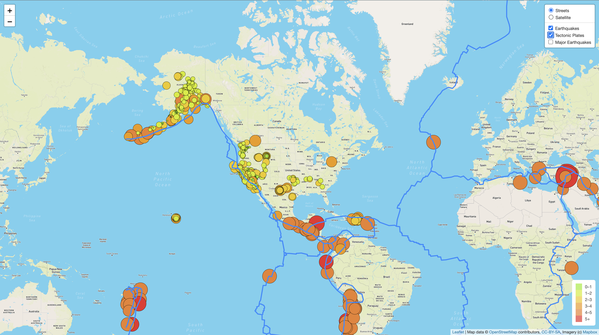
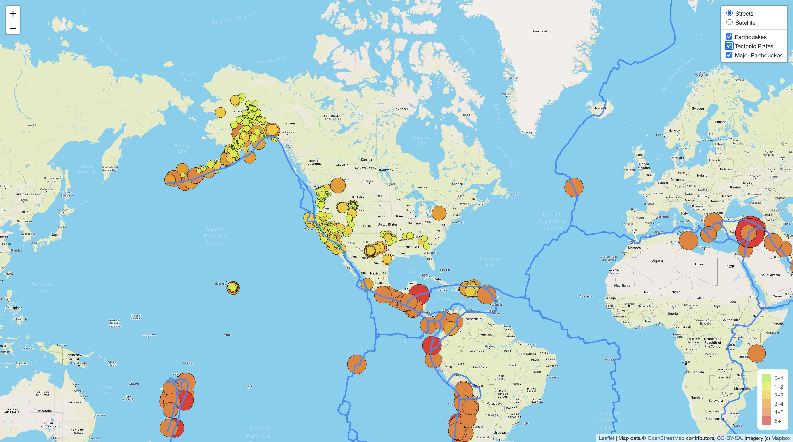

# Mapping_Earthquakes

## Overview

The purpose of this project is to create informative and interactive maps of earthquakes from around the world using an API to pull the respective data, and web tools such as HTML, CSS, and JS to create the maps.

---

## Results

Here is a progressive look at the development of the maps:

### Deliverable 1

    

### Deliverable 2

    

### Deliverable 3

    

